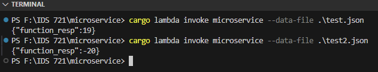
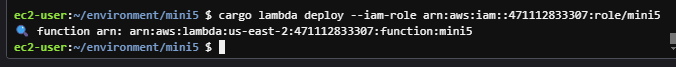
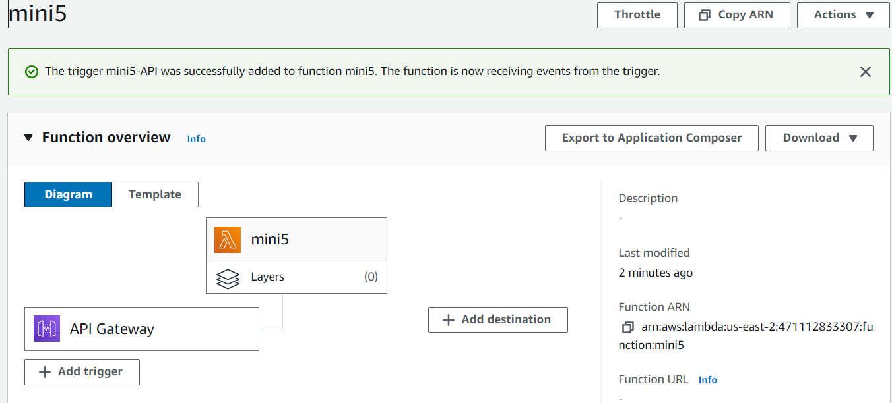
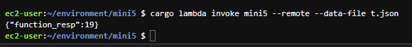
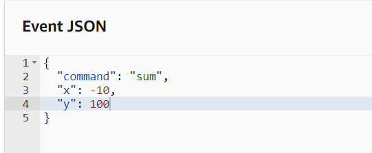
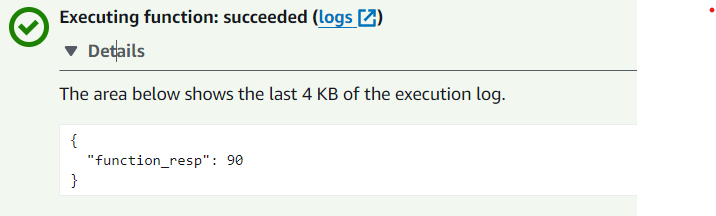
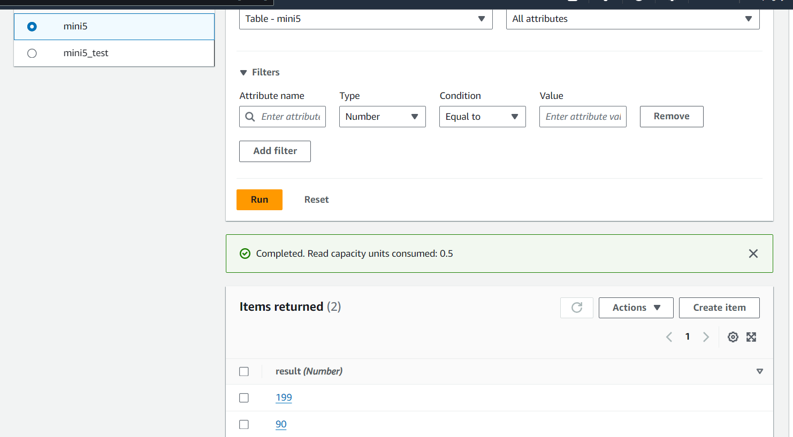

# IDS 721 Mini Project 5 


## Targets
* Create a Rust AWS Lambda function
* Implement a simple service
* Connect to a database (DynamoDB)

## The Lambda Function
* The Cargo Lambda in Rust program contains two functions:
    * `sum` - This function takes 2 integers and returns the sum of the two integers
    * `multiply` - This function takes 2 integers and returns the product of two integers

## Guidelines
1. Install Rust and Cargo Lambda
2. Initialize a new Rust project using `cargo lambda new <project_name>`
3. Write the Lambda function code in the `src/main.rs` file
4. To test the Lambda Function, use cargo lambda watch to build the project, then cargo lambda invoke <function_name> --data-file <json_file>.json to execute the function.
5. Log in to AWS, access the IAM console, create a new user, select "Attach policies directly," and assign "IAMFullAccess" and "AWSLambda_FullAccess" policies.
6. Go to the "Security Credentials" tab, and generate an access key.
7. Save AWS_ACCESS_KEY_ID, AWS_SECRET_ACCESS_KEY, and AWS_REGION in a new .env file.
8. To set environment variables in the terminal, use the following commands:
     ```
     set -a # automatically export all variables
     source .env
     set +a
     ```
    In Powershell: do
    ```
    $env_vars = Get-Content -Path .env
    foreach ($line in $env_vars) {
    $parts = $line -split "=", 2
    [Environment]::SetEnvironmentVariable($parts[0], $parts[1], "Process")
    }
    ```
9. Run `cargo lambda build --release --arm64` to build the lambda function
10. Run `cargo lambda deploy --iam-role <Your role ARN>` to deploy the Lambda Function to AWS from Cloud9
11. Go to the AWS Lambda console and test the function by creating a new test event using the following event JSON:
        ```
        {
            "command": "<insert command>",
            "x": "<insert x>",
            "y": "<insert y>"
        }
        ```
12. Add a new trigger to the Lambda Function by selecting "API Gateway", creating a new API, REST API, and "Open" security
13. Add permission `AWSDynamoDBFullAccess` to the Lambda Function's role
15. Create a new table with the appropriate primary key in DynamoDB console.


### Run Locally:

### Deploy (from Cloud9):

### Add Triggers

### Invoke result



### DynamoDB database
