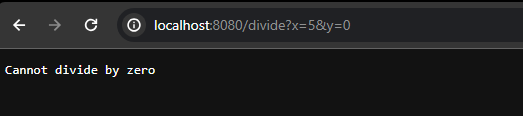
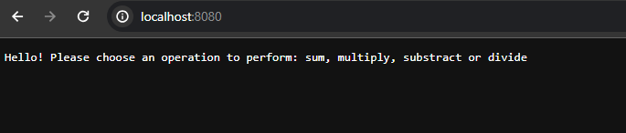
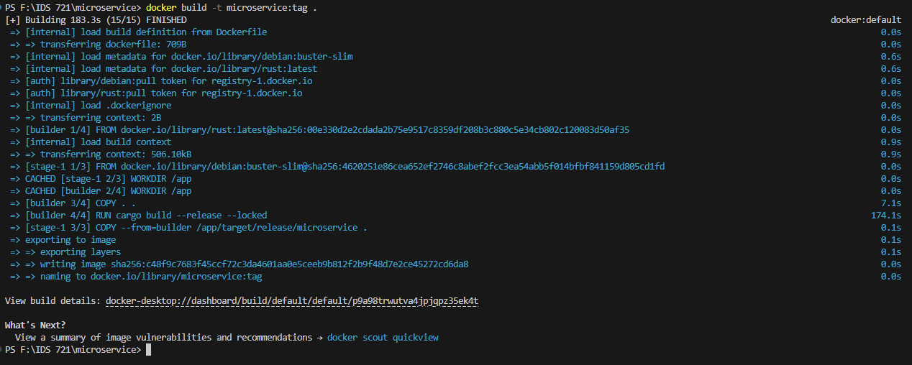
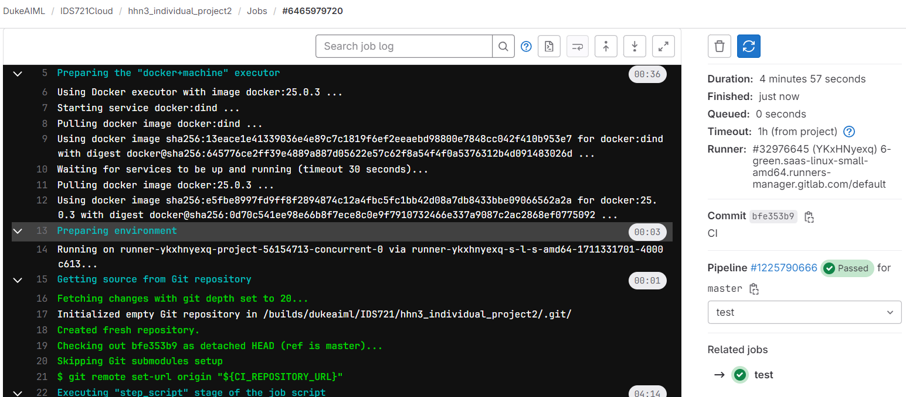

# IDS 721 Individual Project 2


## Targets
* Simple REST API/web service in Rust
* Dockerfile to containerize service
* CI/CD pipeline files

## Demo video:

[[Demo Video]](/demo.mp4)

### Rust code
* The Cargo Lambda in Rust program contains two functions:
    * `Home` - Instruction
    * `sum` - This function takes 2 floats and returns the sum of the two integers
    * `multiply` - This function takes 2 floats and returns the product of two integers
    * `substract` - This functions takes 2 floats and return the difference between them
    * `divide` - This funstion divides 2 floats, error when the divider is 0
## Guidelines
- Install cargo, docker, rust
- To run the program locally:
```
cargo run
```
### Docker
- Create a Dockerfile
```Dockerfile
# Use the right version correponding to your rust version
FROM rust:latest AS builder

# set up work directory
WORKDIR /myapp
USER root

# copy the entire project into the working dicrectory
COPY . .

# compile rust app in the working directory
RUN cargo build --release

# use the right image according to different versions of glibc
FROM debian:bookworm-slim

# set up working directory
WORKDIR /myapp

# copy the executable file to the working directory for easily launching
COPY --from=builder /myapp/target/release/microservice /myapp

# expose port
EXPOSE 8080

# run the app
CMD ["./microservice"]

```
- Turn on Docker
- Build the Docker image:
```
docker build -t image-name .
```
- Run the image
```
docker run -p 8080:8080 imagename
```

- After run the container locally, use the following command to get your hostname:
```
hostname I
```

### CI on Gitlab
- create `.gitlab-co.yml` file:
```yml
image: docker:25.0.3

variables:
  IMAGE_TAG: $CI_REGISTRY_IMAGE:$CI_COMMIT_REF_SLUG
  DOCKER_HOST: tcp://docker:2375
  DOCKER_DRIVER: overlay2
  DOCKER_TLS_CERTDIR: ""

services:
  - docker:dind

stages:
  - test

test:
  stage: test
  before_script:
  - docker login -u "$CI_REGISTRY_USER" -p "$CI_REGISTRY_PASSWORD" "$CI_REGISTRY"
  script:
    - docker build -t ids-individual-2 .
    - docker run -d --name ind-2-container -p 8080:8080 ids-individual-2
    - docker ps -a
```

- Open Gitlab, choose Build, pipelines, then follow the instruction.

## Screen Shots
### Run Locally:


### Docker Image build:

### CI GITLAB
